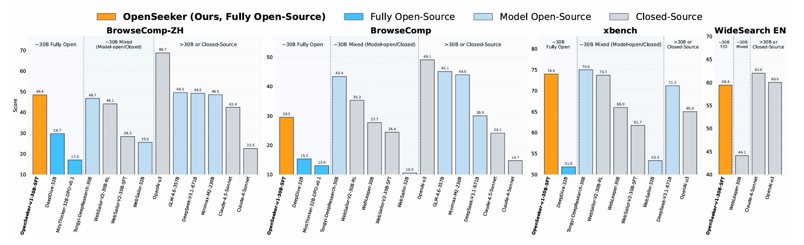
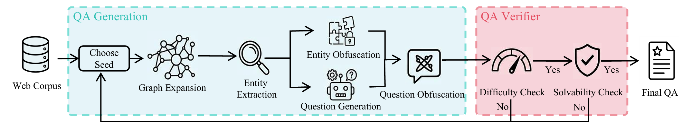
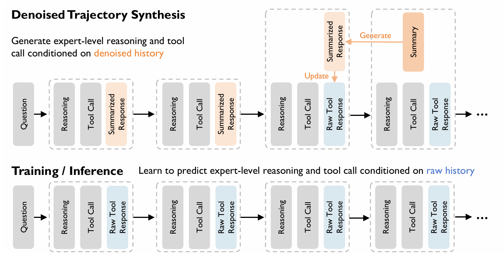

标题：OpenSeeker: Democratizing Frontier Search Agents by Fully Open-Sourcing Training Data
出处：2026/3/16，arxiv
大模型：Deeepseek
### 研究背景与动机：打破搜索智能体的“数据垄断”
近年来，具备深度搜索能力的大语言模型（LLM）智能体发展迅猛，性能在短时间内实现了飞跃。然而，一个严峻的问题随之而来：高性能搜索智能体的训练数据，几乎完全被工业界巨头（如OpenAI、Google、阿里巴巴等）垄断。尽管有些公司开源了模型权重，但其核心的训练数据（特别是复杂的问答对和执行轨迹）却秘而不宣，形成了一道“数据护城河”，严重阻碍了学术界的创新和发展。

现有的开源工作要么性能不佳，要么只开放了部分数据，导致整个开源社区在这一领域进展缓慢。为了改变这一局面，上海交通大学的一个纯学术团队推出了OpenSeeker——首个完全开源（模型+完整训练数据）且性能达到前沿水平的搜索智能体，旨在将这一能力真正“民主化”。
****
注：OpenSeeker 是唯一一个在四个搜索基准测试中实现竞争性能的完全开源代理，令人惊讶的是，仅通过一次训练试验就实现了这一目标。
### 核心方法：两大创新驱动的数据合成技术
OpenSeeker的成功并非依赖于庞大的数据量或复杂的训练技巧，而是通过**高质量的合成数据**。其核心在于两项关键技术，它们共同构建了一个从“问题生成”到“轨迹学习”的高保真数据流水线。

1. **基于事实的可扩展、可控问答合成**
    该方法旨在生成真正需要多步推理的复杂问题，避免模型通过简单的关键词匹配来“作弊”。其流程如下：
    **图扩展与实体提取**：从真实网页的拓扑结构（网络图）出发，随机选取种子页面，通过超链接扩展形成信息子图，并从中提取关键实体，构建“实体子图”。
    **问题生成与混淆**：基于实体子图生成初始问题，确保求解必须遍历图中多个节点。随后，对图中的实体进行“模糊化处理”（例如将“埃菲尔铁塔”替换为“一座位于巴黎的著名铁塔”），生成最终问题。这模拟了用户的真实模糊表达，迫使智能体必须通过搜索来澄清和定位信息。
    **双重验证**：通过“闭卷考试”（模型仅凭自身知识无法回答）和“开卷考试”（提供实体子图后能回答）两个步骤，严格筛选出既有难度又逻辑可解的高质量问答对。

    ****
    注：基于事实的可扩展可控质量保证综合概述。该流水线从图扩展开始，将种子节点扩展为连接页面的子图。实体提取随后将关键信息主题提炼成结构化的实体子图。生成器会根据该结构综合复杂的初始问题（问题生成），确保多跳推理需求。为了增加难度，我们应用实体混淆技术来模糊特定术语，最终产生一个需要深度图遍历才能解决的难题。
    ****
    注：去噪轨迹合成概述。我们采用回顾性总结机制，每次工具调用后，将上一轮的原始响应压缩成“总结响应”，替换历史窗口中的原始工具响应。这种更清晰的语境使教师能够生成高质量的推理和行动。注意不对称性：合成依赖于总结上下文，而训练和推断阶段则基于原始工具响应，迫使模型学习内在的去噪能力。

2. **去噪轨迹合成**
    真实网页充满噪音，如何让智能体学会“拨云见日”是关键。OpenSeeker设计了一种巧妙的不对称上下文训练机制：
    **合成阶段（教师模型）**：在生成“完美”的执行轨迹时，为模型提供一个经过实时总结、去噪的历史上下文。这样，教师模型可以在一个“干净”的环境中，专注于产生清晰的推理和正确的工具调用步骤。
    **训练阶段（学生模型）**：在最终用于训练OpenSeeker的数据中,保留原始的、充满噪音的网页内容，并要求学生模型去预测教师模型在“干净”环境下产生的最优动作。这种“不对称”训练，迫使学生模型内化去噪和信息提取的能力，学会在真实、混乱的网络环境中找到关键信号。

### **主要结果：小数据，大成效**
OpenSeeker在仅使用1.17万条合成样本，并仅进行一次标准监督微调（SFT） 的情况下，在多个权威 benchmarks 上取得了惊艳的成绩：
**全面超越开源模型**：在BrowseComp、xbench-DeepSearch等四个中英文榜单上，OpenSeeker显著优于同规模的开源模型（如DeepDive、WebSailor系列等）。例如在BrowseComp-ZH（中文）上，OpenSeeker（48.4%）远超第二名SFT模型WebSailor-V2（28.3%）。 比肩甚至超越工业级模型：尽管训练资源天差地别，OpenSeeker在BrowseComp-ZH上甚至超过了阿里通义千问的DeepResearch模型（48.4% vs 46.7%），而后者使用了连续预训练、SFT和强化学习等更复杂的全流程训练。
**数据质量是关键**：实验对比证明，数据质量远比数量重要。OpenSeeker仅用1.17万条数据，就超过了使用15万条数据的Mi roThinker等模型，其合成的问题在所需工具调用次数和信息长度上，难度甚至超过了BrowseComp-ZH等现有标杆。

### **个人小结**
OpenSeeker是一项富有远见且扎实的工作，其核心贡献在于证明了高质量合成数据可以成为打破工业界数据垄断的利器。

它让我看到，对于搜索智能体这一复杂领域，“巧干”（数据策略）比“苦干”（堆算力、数据）更为关键。通过将问题构建扎根于真实网页拓扑，并设计精妙的去噪学习机制，一个学术团队同样能训练出顶尖模型。这种100%的开放精神（开源全部数据和代码）将极大降低该领域的研究门槛，激发更多创新。

当然，如论文所提，OpenSeeker仍有巨大提升空间：未来通过优化数据分布、引入更多工具、尝试强化学习等方法，其性能有望更上一层楼。可以说，OpenSeeker不仅是一个模型，更是一个可供整个社区共同迭代和发展的开放平台。

希望这份导读能帮助你快速把握这篇论文的精华。如果你对其中某个技术细节（比如实体混淆的具体实现或去噪机制）有更深的兴趣，我们可以继续探讨。

